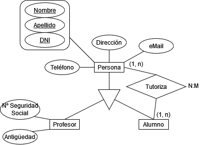
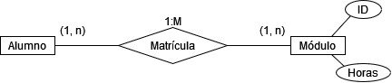
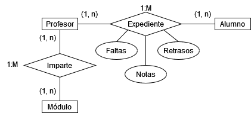
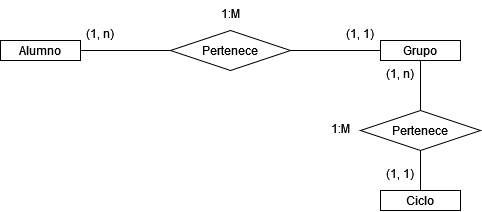
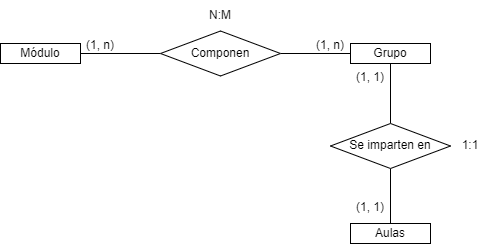
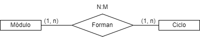
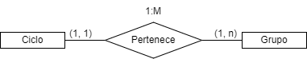
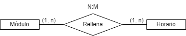
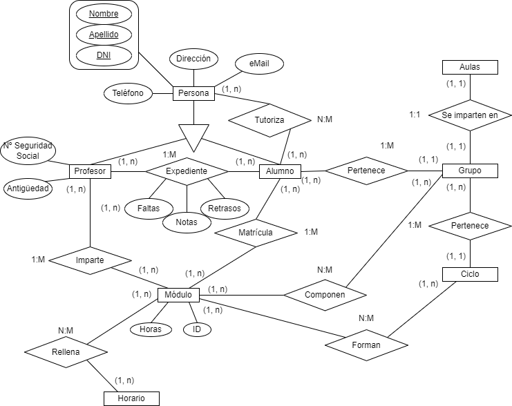

# Práctica 2.1 - Modelo E-R

## Observaciones

+ 3: PROFESOR, ALUMNO y MÓDULO forman una relación ternaria.

---

## Anotación de la entrega

Todos los diagramas entregados se encontrará en **el último apartado de la documentación**.

---

## Documentación

### ¿Qué vamos a hacer?

El diseño de una base de datos para un centro educativo de formación profesional.

### ¿Con qué lo vamos a hacer?

El diseño se ha realizado en Draw.io.

### ¿Cómo se ha hecho?

Simplificando el problema para resolverlo en varias partes en lugar de de golpe.

### ¿Para qué se ha hecho?

Para un centro educativo con formación profesional.

### ¿Dónde se ha hecho?

Mayoritariamente desde mi PC, trabajando en la nube.

### ¿Quién lo ha hecho?

Daniel Píriz Cacho.

### ¿Cuándo se ha hecho?

Completado el 13/10/22.

### Diagramas

#### Diagrama de personas, alumnos y profesores

#### Diagrama de alumno y módulo

#### Diagrama de profesor, módulo y alumno

#### Diagrama de alumno, grupo y ciclo

#### Diagrama de módulo, grupo y aulas

#### Diagrama de módulo y ciclo

#### Diagrama de ciclo y grupo

>Durante el desarrollo he notado que este diagrama es una redundancia del diagrama número 4, que relaciona alumnos, **grupos y ciclos**.

#### Diagrama de módulo y horario

#### Diagrama completo

---

## Enunciado

Esta práctica la iremos resolviendo por partes encajando al final todas las piezas en el diagrama ER de la gestión educativa de un centro.
1. En nuestro centro educativo nos centramos en las personas, ya sean alumnos, profesores u otras. Nos gusta conocer a todas las personas por su nombre y guardamos celosamente los datos de contacto (dirección, tlf, email y DNI). Así mismo, de nuestros alumnos almacenamos el nombre y teléfono de sus padres, y de los profesores su número de la seguridad social y antigüedad en el cargo.
2. Como somos un centro moderno permitimos la matriculación parcial por módulos de nuestros alumnos. Cada módulo tiene un código de curso y un número de horas.
3. Cada módulo será impartido por un profesor que será el encargado de hacer el seguimiento de faltas, retrasos y la evaluación de los progresos (nota) de cada alumno.
4. Los alumnos estararán asociados a un grupo (p.e. DAW1) que pertenece a un ciclo formativo.
5. Los grupos se componen de módulos y se imparten en aulas. Algunos módulos se imparten en grupos distintos.
6. Los módulos pertenecen a alguno de los ciclos formativos (DAW, DAM, SMR, ASIR, etc.).
7. Los grupos también pertenecen a los mismos ciclos.
8. Los módulos rellenan horario total ocupando horas completas organizadas con código L1 para lunes a primera o X4 para miércoles a cuarta.
9. Úne los apartados anteriores en un único modelo ER completo.