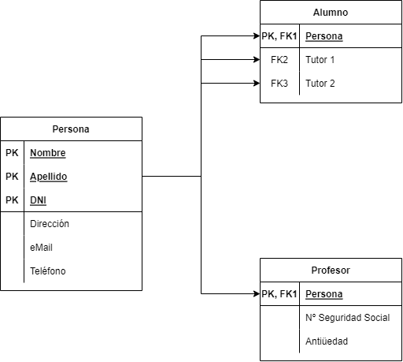
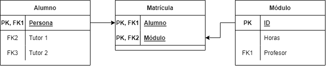
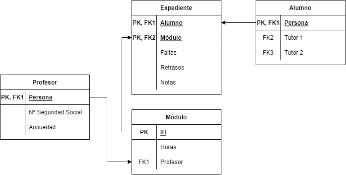
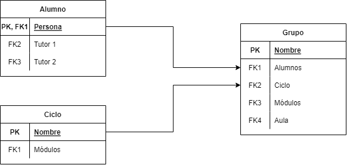
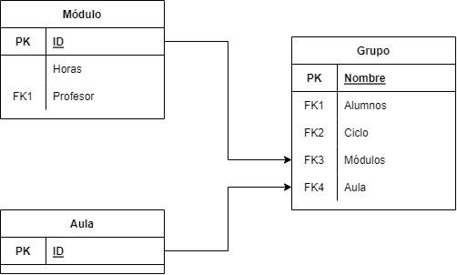
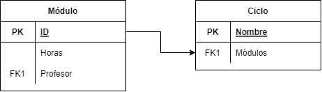
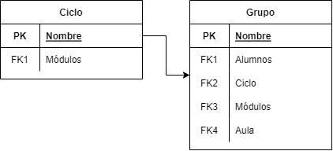
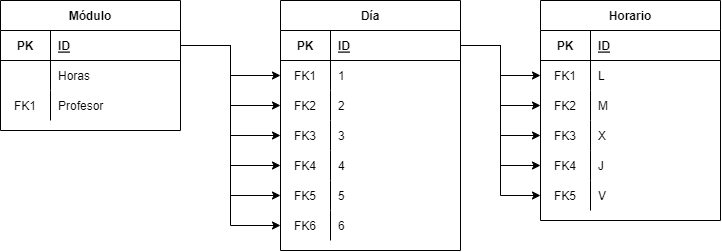
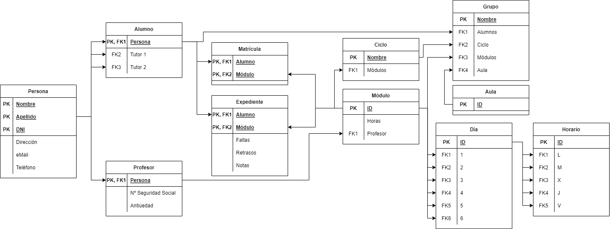

# Práctica 2.2 - Modelo Relacional

## Documentación

### ¿Qué vamos a hacer?

El diseño de una base de datos para un centro educativo de formación profesional.

### ¿Con qué lo vamos a hacer?

El diseño se ha realizado en Draw.io.

### ¿Cómo se ha hecho?

Localizando cada una de las entidades y optimizando la disposición en tablas entre ellas y sus relaciones.

### ¿Para qué se ha hecho?

Para un centro educativo con formación profesional.

### ¿Dónde se ha hecho?

Mayoritariamente desde mi PC, trabajando en la nube.

### ¿Quién lo ha hecho?

Daniel Píriz Cacho.

### ¿Cuándo se ha hecho?

Completado el 15/10/22.

### Diseño de la base de datos

#### Diagrama de personas, alumnos y profesores

#### Diagrama de alumno y módulo

#### Diagrama de profesor, módulo y alumno

#### Diagrama de alumno, grupo y ciclo

#### Diagrama de módulo, grupo y aulas

#### Diagrama de módulo y ciclo

#### Diagrama de ciclo y grupo

>Durante el desarrollo he notado que este diagrama es una redundancia del diagrama número 4, que relaciona alumnos, **grupos y ciclos**.

#### Diagrama de módulo y horario

#### Diagrama completo

---

## Enunciado

Repite los 9 pasos de la práctica de modelo ER* pasándolo a RELACIONAL.

> *Se refiere a la [práctica 2.1](/BASES-DE-DATOS/Practica2.1/)