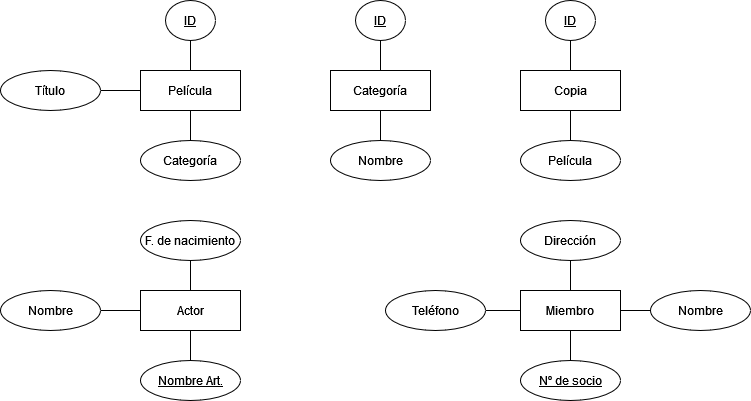
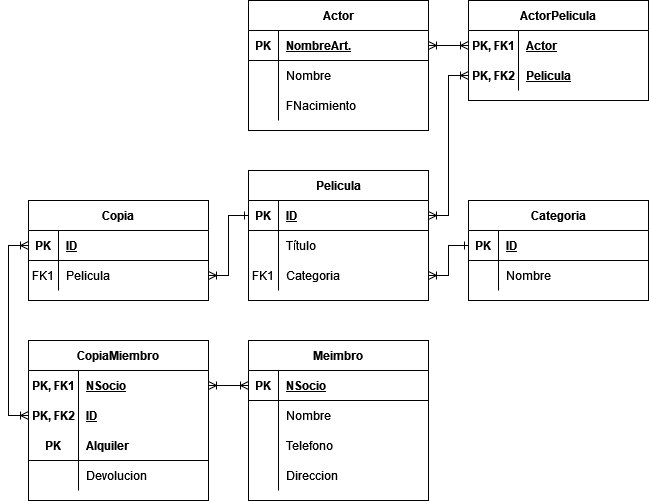

# Práctica 2.3 - Normalización

## Observaciones

+ Pese a que no me has especificado nada sobre 3FN, intuitivamente lo has realizado al sacar la categoría.

---

## Documentación

### ¿Qué vamos a hacer?

El diseño de una base de datos normalizada para un videoclub.

### ¿Con qué lo vamos a hacer?

El diseño se ha realizado en Draw.io.

### ¿Cómo se ha hecho?

Siguiendo los pasos generales para el desarrollo de un diagrama ER en modelo relacional y su normalización hasta 3FN.

### ¿Para qué se ha hecho?

Para un videoclub.

### ¿Dónde se ha hecho?

Mayoritariamente desde mi PC, trabajando en la nube, corregido en clase el día de la entrega.

### ¿Quién lo ha hecho?

Daniel Píriz Cacho.

### ¿Cuándo se ha hecho?

Completado el 21/10/22.

### Procedimiento

#### Entidades

+ Película
+ Categoría*
+ Copia
+ Actor
+ Miembro

> *He idcentificado "categoría" como una entidad para evitar que el videoclub pueda crear accidentalmente dos categorías iguales empleando sinónimos o nomenclaturas diferentes, lo cual será posible si lo dejo como string.

#### Atributos y claves primarias

#### Relaciones

#### Diagrama ER

#### Modelo relacional

> Suponemos que ningún cliente puede sacar más de una copia de la misma película a la vez.

#### Normalización

> Las condiciones de 1FN y 2FN ya se cumplen, puesto que no hay filas multivaluadas y dichas filas son relevantes en cada tabla sin posibilidad de separarlas más.

---

## Enunciado

En un antiguo videoclub se necesita mantener información de alrededor de 3000 DVDs. Cada uno de los DVD tiene asignado un número. Por cada película se necesita conocer un título y categoría por ejemplo: comedia, suspenso, drama, acción, ciencia ficción, etc. Se mantienen algunas copias de muchas películas. Se le da a cada película una identificación. \
Un DVD puede venir en varios formatos y una película es grabada en un solo DVD; frecuentemente las películas son pedidas de acuerdo a un actor especifico Tom Cruise y Demi More son los más populares es por esto que se debe mantener información de los actores que pertenecen a cada película. \
No en todas las películas actúan artistas famosos, a los clientes de la tienda le gusta conocer datos como el nombre real del actor, y su fecha de nacimiento. \
En la tienda se mantienen información solo de los actores que aparecen en las películas y que se tiene a disposición. Solo se alquilan videos a aquellos que pertenecen al vídeoclub. Para pertenecer al vídeoclub se debe tener un buen crédito. Por cada miembro del club se mantiene una ficha con su nombre, teléfono y dirección, cada miembro del club tiene asignado un número de socio. \
Se desea mantener información de todos los DVD que un cliente alquila, cuando un cliente alquila un DVD se debería conocer el nombre de la película, la fecha en la que se alquila y la fecha de devolución.

> Fecha de entrega: *21 octubre*.\
> Forma de entrega: Subir como README.md a repositorio privado en una carpeta T2-Normalización y compartir con @luiscastelar.

