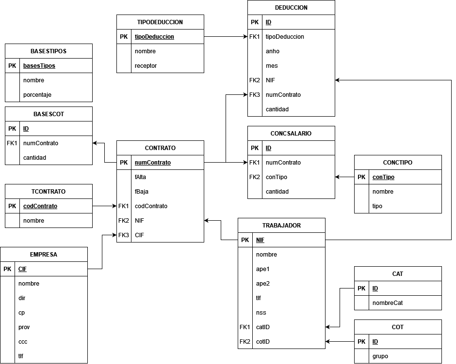
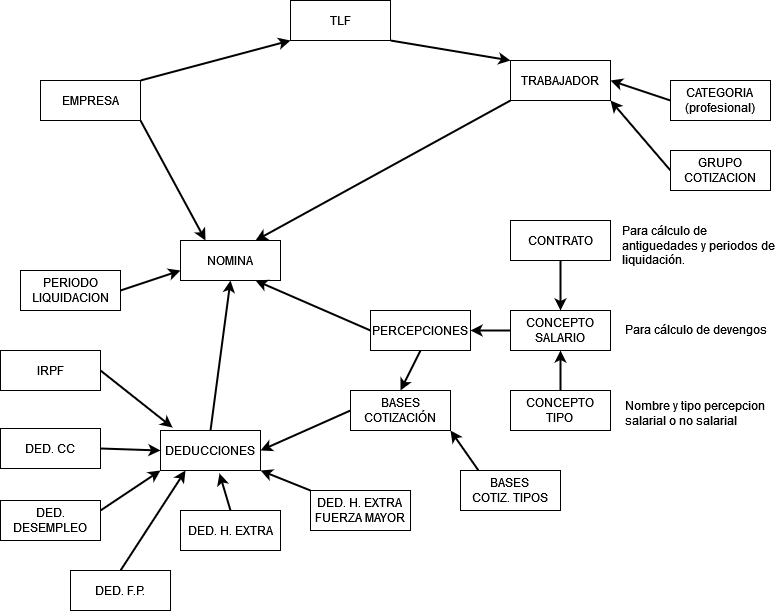

# Práctica 3.1 - Sistema de nóminas

## Archivos incluidos

+ **deploy.sql**: genera la base de datos limpia y lista para su uso.
+ **cleanup.sql**: elimina la base de datos completa.

---

## Documentación

### ¿Qué vamos a hacer?

Crear una base de datos para la gestión del servicio de nóminas de una empresa.

### ¿Con qué lo vamos a hacer?

Vamos a utilizar la consola de MySQL (Shell), scripts y el servidor remoto.

### ¿Cómo se ha hecho?

1. Identificando las dependencias entre las tablas.
2. Elaborando un diagrama relacional.
3. Convirtiendo el diagrama relacional a un código SQL por partes.
4. Refinar y ensamblar el código para su despliegue inmediato.

### ¿Para qué se ha hecho?

Para automatizar la gestión de nóminas en una o varias empresas.

### ¿Dónde se ha hecho?

Mayoritariamente en mi PC.

### ¿Quién lo ha hecho?

Daniel Píriz Cacho.

### ¿Cuándo se ha hecho?

Primera iteración completa el día 15 de noviembre de 2022.

### Diagrama relacional

---

## Enunciado 

Se desea informatizar el servicio de nóminas de una empresa. Para ello deberemos analizar una nómina extrayendo las distintas entidades y relaciones.

Concretamente partiremos de:

**Donde:**

+ EMPRESA (CIF, nombre, dir, cp, prov, ccc, tlfID)
+ TRABAJADOR (NIF, nombre, ape1, ape2, tlfID, nss, catID, cotID)
+ TLF (ID, pre, tlf)
+ CAT (ID, nombreCat)
+ COT (ID, grupo)
+ CONTRATO (numContrato, fAlta, fBaja, codContrato, NIF, CIF)
+ TCONTRATO (codContrato, nombre)
+ CONCSALARIO (ID, numContrato, conTipo, cantidad)
+ CONCTIPO (conTipo, nombre, tipo)
+ PERCEPCION <= CONCSALARIO
+ BASESCOT (ID, numContrato, cantidad)
+ BASESTIPOS (ID, nombre, porcentaje)
+ DEDUCCION (ID, …)

— *Otras tablas:* - (*) Un mismo trabajador puede realizar n aportaciones en un mes.

+ IRPF (ID, anho, mes, NIF, numContrato, cantidad) => Hacienda
+ DEDCC (ID, anho, mes, NIF, numContrato, cantidad) => SES
+ DEDDES (ID, anho, mes, NIF, numContrato, cantidad) => SEPE
+ DEDFP (ID, anho, mes, NIF, numContrato, cantidad) => SEXPE
+ DEDHEXTRA (ID, anho, mes, NIF, numContrato, cantidad) => Hacienda
+ DEDHEXTRAFM (ID, anho, mes, NIF, numContrato, cantidad) => Hacienda

… Entonces parace que mejor todas en una sola tabla con el código del tipo de deducción:

+ DEDUCCION (ID, tipoDeduccion, anho, mes, NIF, numContrato, cantidad)
+ TIPODEDUC (tipoDeduccion, nombre, receptor)