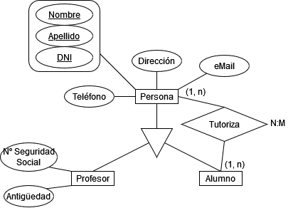
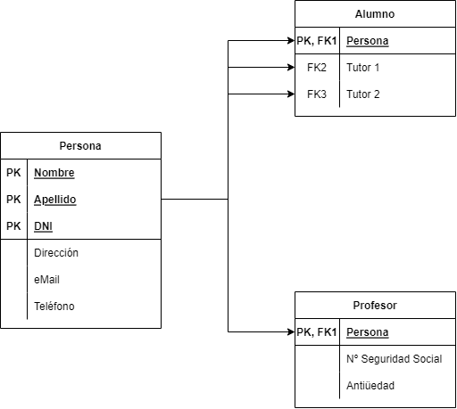

# Tema 7 - Bases de datos objeto - relacional, PostgreSQL

## Anotaciones de la entrega

1. [Script solicitado](./run.sql)
2. [Script de limpieza](./clear.sql)
3. Se han omitido todas las tildes (compatibilidad).

---

## Documentación

### ¿Qué vamos a hacer?

Una base de datos similar a la de la [Práctica 2.1](../t2/t2.1/) utilizando PostgreSQL.

### ¿Con qué lo vamos a hacer?

Utilizando el contenedor (Docker) de PostgreSQL y Adminer.

### ¿Cómo se ha hecho?

1. Creando la base de datos con el nombre adecuado (`23_db_Daniel`, en este caso).
2. Creando un nuevo esquema con los datos de las personas y dos roles: uno para profesores y personas que puedan acceder y editar información de las tablas, y otro de mantenimiento, que puede modificar la estructura de las tablas.
3. Se han creado las tablas `Persona`, `Alumno` y `Profesor` de acuerdo con las especificaciones. Las dos últimas descienden de `Persona`.
4. Se ha creado el tipo `DIRECCION`, que contiene toda la información necesaria. Seguidamente, se altera la tabla `Persona` para que tenga un tipo `DIRECCION` en lugar de `TEXT`. Esta modificación también altera las tablas descendientes.
5. Se insertan dos datos de prueba en cada una de las tablas.

### ¿Para qué se ha hecho?

Para aprender las nociones básicas de una base de datos objeto-relacional.

### ¿Dónde se ha hecho?

Completamente en clase.

### ¿Quién lo ha hecho?

Daniel Píriz Cacho.

### ¿Cuándo se ha hecho?

Completado el día 21/04/2023.

### Diagramas implementados

---

## Enunciado

Crear un script en PostgreSQL que:

1. Cree una DB con tu NUM_db_NOMBRE similar a la que tenías en MariaDB.
2. Crea un usuario y asígnale los permisos sobre la DB anterior.
3. Crea un esquema que permita implementar el apartado 1 de la Práctica 2.1 (Personas, Alumnos y Profesores).
4. Modifica Personas de forma que tenga una tipo personalizado de datos denominado DIRECCIÓN que contenga: tipo, nombre, número, piso, letra, cp, localidad y provincia. Por ejemplo: Av de la Constitución 23, 4º J, 06001, Badajoz, Badajoz.
5. Ingresa 2 personas, 2 alumnos y 2 profesores.