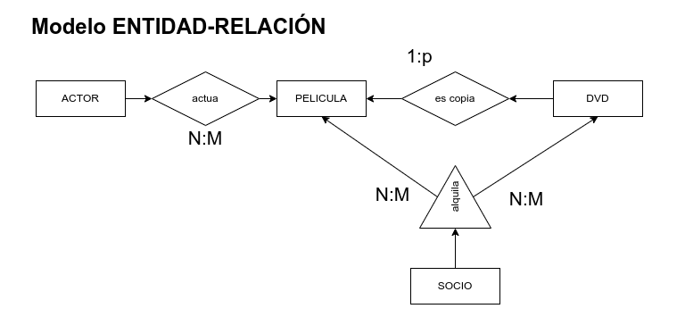

# Práctica 8 - MongoDB

## Documentación

### ¿Qué vamos a hacer?


### ¿Con qué lo vamos a hacer?


### ¿Cómo se ha hecho?


### ¿Para qué se ha hecho?


### ¿Dónde se ha hecho?


### ¿Quién lo ha hecho?

Daniel Píriz Cacho.

### ¿Cuándo se ha hecho?


### Estructura mapeada de la base de datos (bson)

PELICULAS
```
{
	"id": "0123456789",
	"titulo": "Lo que sea",
	"copias": [
		"0123456789",
		"9876543210"
	]
}
```

ACTORES
```
{
	"id": "0123456789",
	"nombre": "Alguien",
	"nacimiento": "1-1-199"
}
```

actuaciones
```
{
	"pelicula_id": "0123456789",
	"actor_id": "0123456789"
}
```

SOCIOS
```
{
	"id": "0123456789",
	"nombre": "Alguien",
	"telefono": "123456789",
	"direccion": "Calle algun lugar, 00000, una ciudad, un país"
}
```

alquileres
```
{
	"pelicula_id": "0123456789",
	"copia_id": "0123456789",
	"socio_id": "0123456789",
	"fecha_alquiler": "AAAA-MM-DD",
	"fecha_devolucion": "AAAA-MM-DD"
}
```

---

## Enunciado



1. Mapea(1) las distintas entidades (2).
2. Mapea las relaciones de forma flexible según modelo NoSQL donde tenemos relaciones del tipo 1-1, 1-p, 1-M y N-M.
3. Establece un sistema que permita un CRUD completo con las siguientes consultas.
    * Se desea sacar un listado de los socios con el alquiler de los últimos 3 meses. Deberás mostrar socio_id nombre y nombre de la película alquilada.
    * Dada la consulta anterior, y a través del atributo pelicula_id, lista los 5 actores más visionados.
    * Como todos sabemos, con el tiempo los DVD se van estropeando con el uso por lo que se desea obtener un listado de los DVD físicos más alquilados (los 20 primeros).
    * Todos sabemos que en España tienen una manía horrible de traducir los títulos, a veces de formas poco afortunadas... Dejar una función que permita corregir el nombre de una película.
    * Para cumplir con la RGPD debemos crear una función que permita eliminar los datos de aquel socio que lo solicite.

(1) [Mapeo de entidades y relaciones](https://es.accentsconagua.com/articles/code/mapping-relational-databases-and-sql-to-mongodb.html).
(2) Recuerda que tienes todos los atributos en la [práctica 2.3](../t2/t2.3/) de [normalización](https://moodle.educarex.es/iescastelarfp/mod/resource/view.php?id=27555).