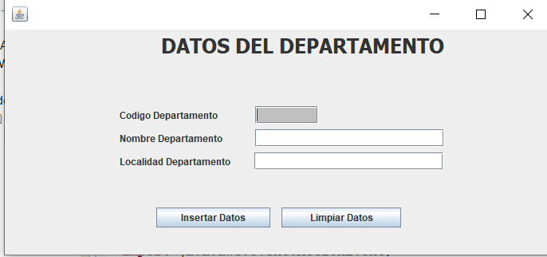
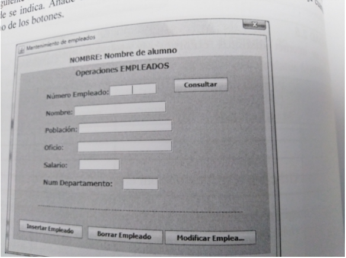

# Actividad 3.3 - Windowbuilder

## Enunciado 1

Realiza con Windowbuilder las siguientes interfaces:

## Enunciado 2

[Enunciado en Moodle, realizar con Google Drive.](https://moodle.educarex.es/iescastelarfp/mod/assign/view.php?id=24642)