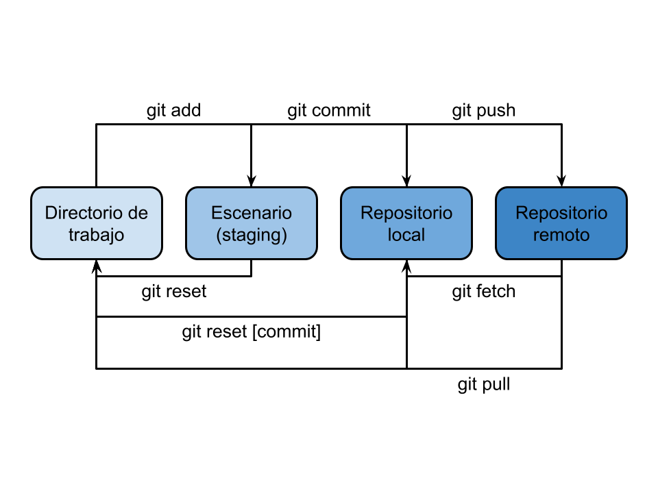

# Práctica 1.1 - Repositorios Git locales y remotos

## Evaluación:

+ El desarrollo parece correcto y my bien estructurado.
+ La documentación está completa, pero las capturas no las has integrado en la misma.
+ Una vez en la terminal, salirse para realizar la captura del contenido de un directorio es __muy__ ineficiente. Utiliza un `dir` o `ls` (según proceda) para realizarla desde la propia terminal. Además, los servidores no suelen tener entorno gráfico y no podrás hacerlas desde windows. 

**Importante**
+ Debes sacar del REPO todo aquello que no sean las prácticas estrictas de clase, o al menos de la rama `main`.

  **Nota: 9,5/10**

## Documentación

### ¿Qué vamos a hacer?

Vamos a crear un repositorio Git para seguidamente publicarlo en un GitHub privado donde también se encuentra el profesor.

### ¿Con qué lo vamos a hacer?

Esta práctica requiere la utilización de Git (mediante terminal bash), una cuenta en GitHub y un repositorio en la misma plataforma.

### ¿Cómo se ha hecho?

Siguiendo los siguientes pasos:
1. Instalar Git
2. Crear cuenta de GitHub
3. Crear repositorio de GitHub
4. Crear y autorizar clave ssh
5. Clonar repositorio vacío
6. Crear README.md en todas las subcarpetas necesarias del repositorio
7. Tomar capturas de pantalla requeridas en la actividad
8. Commit y push al repositorio remoto

### ¿Dónde se ha hecho?

Una parte se ha elaborado en el portátil de clase, aunque se ha realizado un clon del repositorio en mi casa.

### ¿Quién lo ha hecho?

Daniel Píriz Cacho.

### ¿Cuándo se ha hecho?

Entre los días 26 de septiembre y 5 de octubre de 2022.

### Esquema a seguir

---

## Enunciado

1. Create una cuenta en github (con el email corporativo).
2. Crea un repositorio privado (vacío).
3. Sigue los pasos que te proporciona para crear un git local o subir uno existente.
4. Crea un README.md con:
   + Autor del repositorio
   + eMail de contacto (corporativo)
   + Módulos a revisar (los que te imparto)
5. Crea un subdirectorio con NOMBRE-DEL-MÓDULO
   + Crea un README.md con listado de tareas y su estado (método Kanban).
   + Crea un archivo *md* con nombre T1-PracticaGit.md
6. En otra carpeta, clona tu repositorio remoto.
   + Captura de pantalla.
   + Súbela a ./img
   + Enlázala a T1-PracticaGit.md
7. Invítame (@luiscastelar) a colaborar.
8. Marca la práctica 1 como "en espera"
