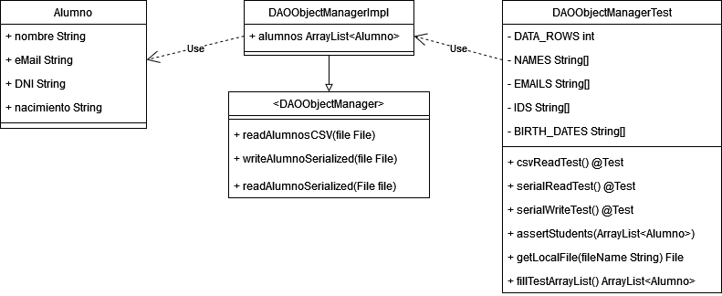

# Práctica 10.1 - Archivos

## Anotaciones de la entrega

1. Me resulta más correcto que los métodos de `DAOOBjectManagerTest` reciban los archivos según las características especificadas en el enunciado a que las posean "hardcodeadas".
2. El test hace uso de `getResource()` y el directorio temporal para probar los métodos de lectura y escritura, de modo que pueden ejecutarse en cualquier máquina.
3. Se ha cambiado la versión de JUnit para que funcione con IntelliJ.

---

## Documentación

### ¿Qué vamos a hacer?

Vamos a crear una interfaz DAO y su implementación para una clase `Alumno`, que tiene nombre, email, DNI y fecha de nacimiento como atributos.

### ¿Con qué lo vamos a hacer?

Utilizando la clase Files de Java y JUnit.

### ¿Cómo se ha hecho?

Se ha implementado la sencilla clase `Alumno` y diseñado la interfaz `DAOObjectManager`. Después, se ha implementado la clase `DAOObjectManagerImpl`, que utiliza la interfaz de lectura y escritura de archivos para importar archivos CSV como una lista de la clase `Alumno`. Además, también puede escribir y leer archivos serializados.

El test de JUnit instancia `DAOObjectManagerImpl` con el archivo alumnos.csv y comprueba paso a paso que los valores introducidos son los correctos. Seguidamente, prueba a exportar la clase a un archivo serial y a reimportarla para volver a comprobar los valores.

### ¿Dónde se ha hecho?

Completamente en clase.

### ¿Quién lo ha hecho?

Daniel Píriz Cacho.

### ¿Cuándo se ha hecho?

Completado el 29/03/2023.

### Diagrama de clases

---

## Enunciado

Crea un archivo en Office Calc con el formato CSV y los valores:

|nombre|email                       |dni        |f nacimiento|
|:----:|:--------------------------:|:---------:|:----------:|
|Juan  |juan@miemail.es 	        |12345678a 	|25/1/2000   |
|Pedro |pedro.gonzalez@mi.email.es 	|23456789b 	|1/10/2005   |

1. Crear objeto que mapee dicho archivo.
2. Crea una interfaz DAO
3. Implementa la interfaz DAO que permita leer el archivo de texto CSV
4. Crear una colección que almacene los datos del archivo
5. Implementa la interfaz DAO que permita serializar y escribir a archivo alumnosSerializados.serialize
6. Crear una colección con datos para leer
7. Implementa el método DAO que permita leer el archivo serializado y lo guarde en el objeto del punto anterior.
8. Muestra por pantalla los datos leídos.