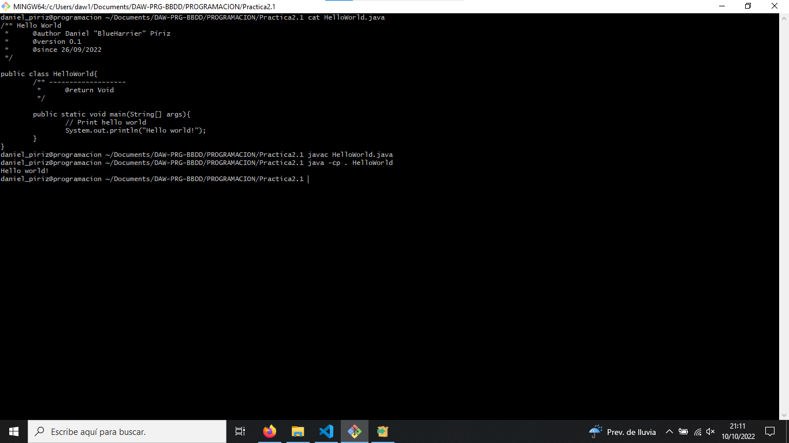

# Práctica 2.1 - Java: hola mundo

## Observaciones

+ Debes respetar los nombres que se dan a los interfaces. La clase debe llamarse HolaMundo, no HelloWord.
+ Corregido.

---

## Captura

---

## Documentación

### ¿Qué vamos a hacer?

Vamos a crear un programa "Hello World" (hola mundo) utilizando Java para dar los primeros en el lenguaje.

### ¿Con qué lo vamos a hacer?

Utilizando un editor de código de confianza y Git.

### ¿Cómo se ha hecho?

Definiendo la clase inicial y su método main, que debe ser público, estático y no devolver nada.

### ¿Dónde se ha hecho?

Se ha elaborado al completo en clase.

### ¿Quién lo ha hecho?

Daniel Píriz Cacho.

### ¿Cuándo se ha hecho?

Aunque se ha perdido la fecha original de creación, se creó en la semana del 26 de octubre de 2022.

---

## Enunciado

1. Crea una Clase denominada HolaMundo que simplemente imprima un hola mundo por pantalla (CLI) cuando sea ejecutada.
2. Complilar
3. Ejecuta y muestra una captura de:
   + Terminal con el Promt String del tipo `nombre_alumno@programacion ~/programacion/nombre_practica`
   + `cat HolaMundo.java`
   + Línea de complilación.
   + Línea de ejecución.
   + Resultado.

   *Recuerda que debe mostrar todo eso y sólo eso (ejecuta `clear` antes de hacer la captura).*

4. Crea en tu REPOSITORI_PERSONAL/PROGRAMACION una carpeta que se llame `P2-HolaMundo` y dentro sube:
   + Tu archivo fuente (del hola mundo).
   + Captura del punto 3.
   + Archivo README.md con la documentación del sistema (respuesta a las 7 pregutas) con integración de la captura del punto anterior.