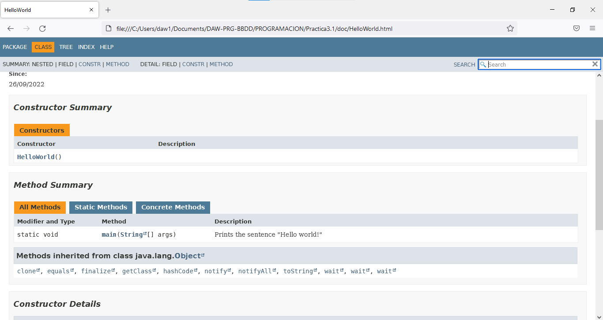

# Práctica 3.1 - Documentación

## Observaciones

+ Falta el archivo fuente.
+ Corregido.

---

## Anotación de la entrega

Por costumbre, todos los comentarios y documentación están escritos en **inglés**.

---

## Captura

---

## Documentación

### ¿Qué vamos a hacer?

Generar la documentación de Java sobre el  programa "Hello world".

### ¿Con qué lo vamos a hacer?

Utilizando la aplicación oficial `javadoc`, que genera automáticamente la documentación de archivos `.java`.

### ¿Cómo se ha hecho?

Llamando a `javadoc HelloWorld.java` tras haber preparado la documentación a través de comentarios sobre el código.

**Problema encontrado:** javadoc.exe y sus librerías necesarias NO ESTABAN en la carpeta en la que deberían. He tenido que cambiar la ruta en las variables de entorno a la raíz del JDK.

### ¿Dónde se ha hecho?

Completamente en el ordenador de clase.

### ¿Quién lo ha hecho?

Daniel Píriz Cacho.

### ¿Cuándo se ha hecho?

Completada el 11/10/22.

---

## Enunciado

1. Partiendo de la práctica anterior, documentala (comentarios de documentación).
2. Realiza una captura de la web generada con tu clase.
3. Crea en tu REPOSITORI_PERSONAL/PROGRAMACION una carpeta que se llame `P3-JavaDoc` y dentro sube:
   + Captura del punto 2.
   + Archivo README.md con la documentación del sistema (respuesta a las 7 pregutas) con integración de la captura del punto anterior.