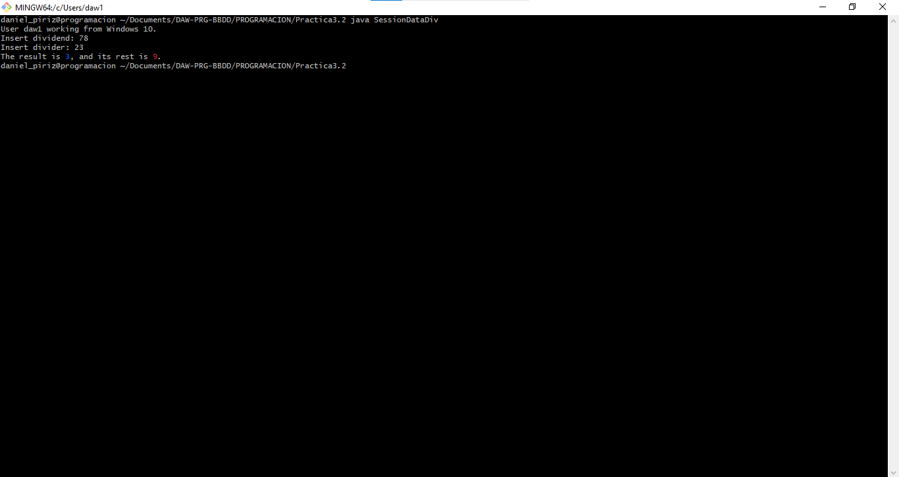

# Práctica 3.2 - Comunicando con el mundo

## Documentación

[Código fuente del programa.](./src/)

### ¿Qué vamos a hacer?

Crear un programa en Java que obtiene datos del sistema, divide dos números y muestra el resultado y el resto en dos colores diferentes.

### ¿Con qué lo vamos a hacer?

Utilizando un editor de código de confianza, en este caso, VSCode.

### ¿Cómo se ha hecho?

Utilizando constantes para definir los colores ANSI, tomando la consola desde System y utilizándola para realizar las preguntas pertinentes. Seguidamente, los operadores `/` (división) y `%` (módulo / resto) realizan su trabajo. Cabe destacar también las múltiples conversiones explícitas entre ints y strings.

### ¿Dónde se ha hecho?

Realizado completamente en mi PC.

### ¿Quién lo ha hecho?

Daniel Píriz Cacho.

### ¿Cuándo se ha hecho?

Completado el 12/10/22.

### Captura del programa

---

## Enunciado

1. Crea una clase que recoja el nombre de usuario del sistema y  del sistema operativo y los muestre por pantalla.
2. Además debe solicitar 2 números enteros y mostrarlos por pantalla como "operador 1" y "operador 2".
3. Debe mostrar la división (en azul) y el resto (en rojo) de operar ambos datos (operación módulo).
4. Subir archivo fuente y una captura del resultado (como siempre cambiando el *Promt Strint*) a la carpeta `P3-JavaBasicIO`.

*Nota*: tienes toda la información de como recoger los valores del sistema en la [doc oficial](https://docs.oracle.com/javase/tutorial/essential/environment/sysprop.html) y algunos ejemplos prácticos.
*Nota 2*: tienes información sobre como colorear las salidas [aquí](https://www.geeksforgeeks.org/how-to-print-colored-text-in-java-console/).
