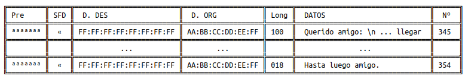

# Práctica 8.2 - Collections: Transmisor de Datos

## Anotaciones de la entrega

La entrada de datos ha cambiado de archivo a manual, en este caso, está "hardcodeada" como final String (Lorem Ipsum).

---

## Documentación

### ¿Qué vamos a hacer?

Un programa que simule la transmisión de un archivo por terminal.

### ¿Con qué lo vamos a hacer?

Implementando una clase `TransmisionDeArchivos` que va a tomar un texto, segmentarlo tantas veces como sea necesario e imprimirlo por pantalla.

### ¿Cómo se ha hecho?

El programa consta de dos partes:

**Codificación:** los valores de direcciones MAC, preámbulo, etc., están introducidos de antemano en el programa, por tanto puede construir directamente las secuencias utilizando un StringBuilder, considerando la longitud máxima del texto y dividiendo cada segmento según esta. Dichos segmentos se convierten a String y se guardan en una ArrayList dinámicamente para ser devuelto, listos para ser leídos e impresos caracter a caracter.

**Impresion:** el sistema gráfico es la parte más extensa, y también es la responsable de realizar los delays (`Thread.sleep`). Los métodos utilizados para esta tarea son `printStrip`, que imprime una línea de caracteres, `printFirstStrike`, que imprime la parte superior de la línea, `printMiddleStrike`, que imprime una línea de separación horizontal, y `printLastStrike`, que imprime la línea final. En cuanto al método `transmitData`, que realiza la transmisión de datos de un String dado, es más complejo. Hay una plantilla "hardcodeada", `FILL_STRIP`, que es un String que contiene los caracteres de la tabla, espacios y caracteres NULL. Por la forma en que funciona Java, estos se pueden utilizar (Java guarda la longitud del String, por tanto, no tiene terminación NULL). El programa lee cada caracter de la plantilla, si es NULL, escribirá uno del String de entrada, si no, escribirá el caracter que se ha introducido, de esta forma, a medida que lea sabrá de forma dinámica cómo colocar cada caracter.

### ¿Dónde se ha hecho?

Completamente en el ordenador de clase.

### ¿Quién lo ha hecho?

Daniel Píriz Cacho.

### ¿Cuándo se ha hecho?

26/01/2023.

---

## Enunciado

En esta ocasión vamos a implementar una aplicación que envíe archivos a través de tramas ethernet.

*Puesto que nosotros no vamos a trasmitir realmente por la interfaz de red lo que haremos será los bytes leídos de un archivo los imprimiremos en pantalla a ritmo constante y por supuesto teniendo algunas cosideraciones para dar veracidad a la transmisión.*

Como en todas las transmisiones deberemos tomar las siguientes consideraciones:
+ Antes de comenzar determinaremos la tasa de transmisión. *En la vida real se realizaría según la velocidad de nuestra tarjeta y conexión, pero nosotros la leeremos por teclado en formato `0.2` (en segundos)*
+ Además leeremos el nombre del archivo a cargar en memoria.
+ Si el archivo lo trocearemos en trozos de 60 (caracteres).
+ Cada trozo lo deberemos empaquetar en una trama ethernet 802.3 (https://es.wikipedia.org/wiki/IEEE_802.3):
  1. Preámbilo: 7 veces el carácter '\u00AA' (ª)
  2. SFD (comienzo de trama) '\u00AB' («)
  3. Dirección destino (broadcast) "\u00FF:\u00FF:\u00FF:\u00FF:\u00FF:\u00FF"
  4. Dirección origen (el de vuestra mac /ipconfig /all/)
  5. Longitud: 60 caracteres o los que queden en el último envío (con 3 dígitos).
  6. Datos
  7. Nº de trama (número de 3 dígitos correlativo comenzando por un número aleatorio)
+ Entre trama y trama introduciremos un final de línea.
+ Vamos a dejar bonita la pantalla. Vamos a encapsular las tramas de forma que tras leer el nombre del archivo borraremos y comenzaremos imprimiento la cabezera de la tabla de envíos y debajo cada uno de los paquetes separando sus campos con \|, de forma que nos quede algo tal que así:

Los bordes de la tabla aquí -> https://en.wikipedia.org/wiki/Box_Drawing

Nota:
Nos hemos tomado algunas licencias artísticas, pero el envío puede ser similar a esto.

### Instrucciones de entrega

Debe entregarse tanto la clase `TransmisionDeArchivos` como la salida por pantalla que `llamaremos transmision.log`

Para capturar la salida por pantalla deberemos invocar el programa desde PowerShell con el comando Tee-Object de la siguiente forma: `java TransmisionDeArchivos | Tee-Object -FilePath "transmision.log"`

*Esta práctica será corregida de forma automática con el comando `diff` por lo que sugiero la personalización en la salida imprimiendo tu nombre completo y que ajustemos la salida a las especificaciones del sistema.*