# BlueHarrier

🐦 Hello there and welcome to the nest. Here you'll find all of what I've done so far or stuff that I'm working on right now. Feel free to have a look or comment on it if you wish!

## Career

I'm a teacher and video game developer. I've been working on video games since 2016, and worked as a volunteer on robotics education using Minecraft from 2014 to 2018. I also completed a Unity summer course on 2017, and a professional expert in educational robotics course on 2019. My team and I were also finalists on the Spanish programming competition "ProgramaMe" 2023, and I attended to two RoboRave Iberias, 2016 as a drone pilot (participant) and 2017 with the Sirok3D 3D printing stand.

I have been working in Arima ESG Tech as a full-stack developer since 2024, specializing in a 3D agricultural engineering web application involving MapLibre GL JS, GeoServer, Spring boot, among others.

## Software development

I'm working on [Arima ESG](https://www.linkedin.com/company/arima-esgtech/posts/?feedView=all), an agricultural engineering platform that allows technicians and investors to control what, when and where everything is happening on the field. It features a 3D digital twin that displays real-time information about the multiple activities taking place, including locations and external irrigation provider integrations.

At the same time, back in my home server, I'm developing a [Nakama](https://heroiclabs.com/nakama/) based gaming application that will allow me to create online multiplayer games. This framework uses Go to work.

## Video games

### [Ghostly Room Service](https://blueharrier.itch.io/ghostly-room-service)

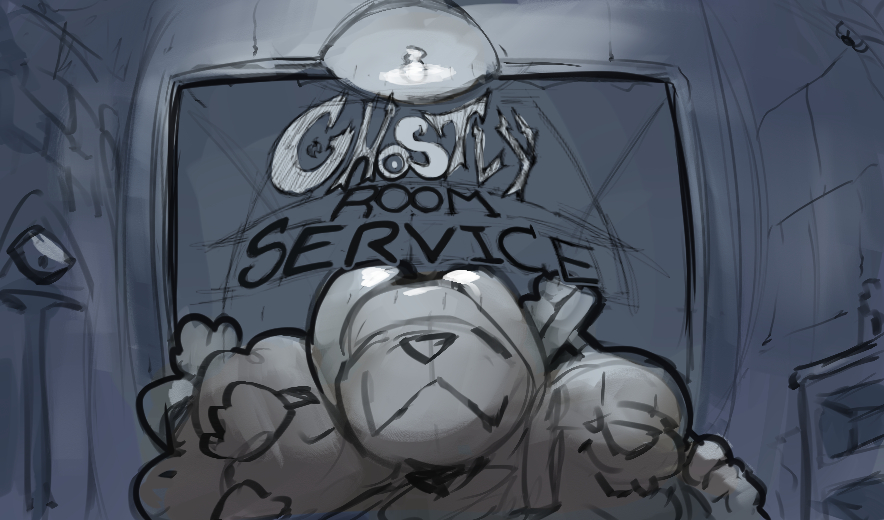

Announced in April 1st 2026 (not for the April fools), this game is an online PvP 1 Vs 5 asymmetrical multiplayer game where four players have to complete their tasks in order to win, and a ghost player that haunts a hotel has to prevent them from doing so. The release date hasn't been announced as it's still work in progress. More information will be released as we develop.

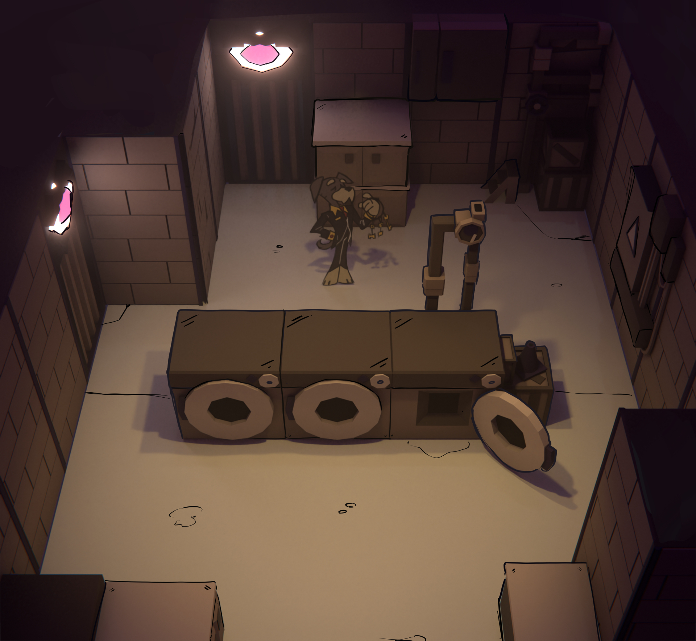

My role for this project is project director and lead programmer. I'm making core mechanic decisions, coordinating the team, all the game logic scripts, and programming and hosting all the back-end infrastructure.

### [Downhell](https://blueharrier.itch.io/downhell)

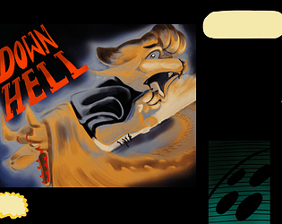

Third place on [Revival Jam 2025](https://itch.io/jam/revival-jam-2025). A 2D narrative game about a friend group that gets lost in the forest and has to escape from a monster, with an interesting twist at the end.

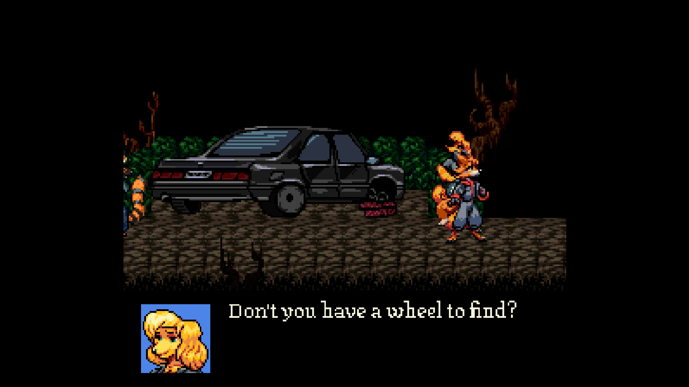

My role for this project was project director and lead programmer. I coordinated the team, designed the core mechanics and programmed all the scripts.

## Render engines

I've always been passionate about rendering and 3D graphics. Between 2018 and 2022 I worked on the Hourglass Framework, a GameMaker: Studio 2 framework that supported 3D graphics (the engine is almost exclusively 2D).

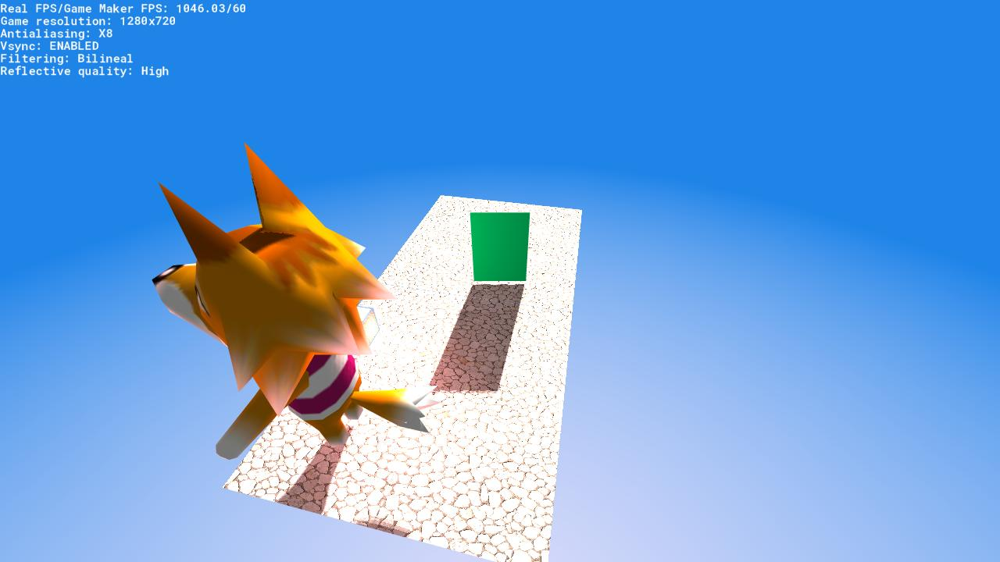

This framework supported 3D object systems, multilayered materials, opaque and tinted shadows, lighting, static and dynamic objects and reflections.

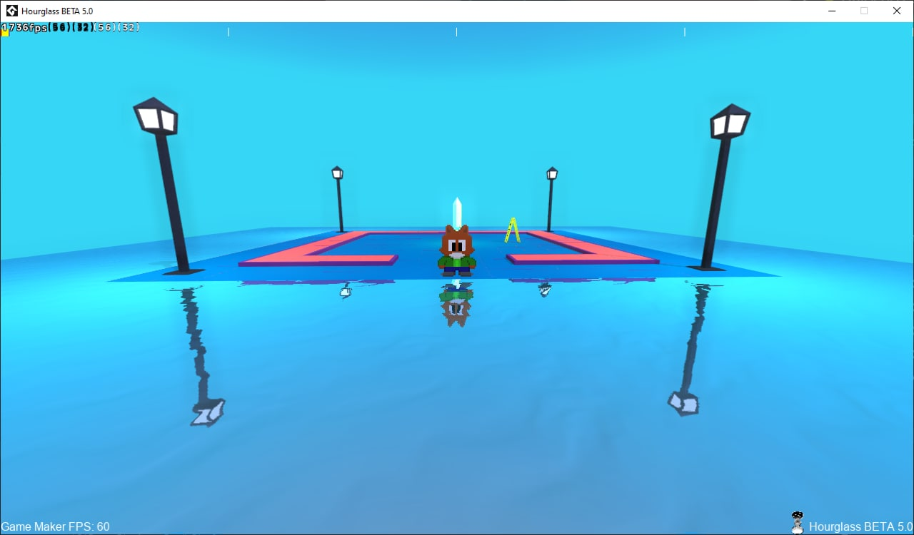

More recently, in 2025, I made a simple renderer made in Rust with OpenGL as well.

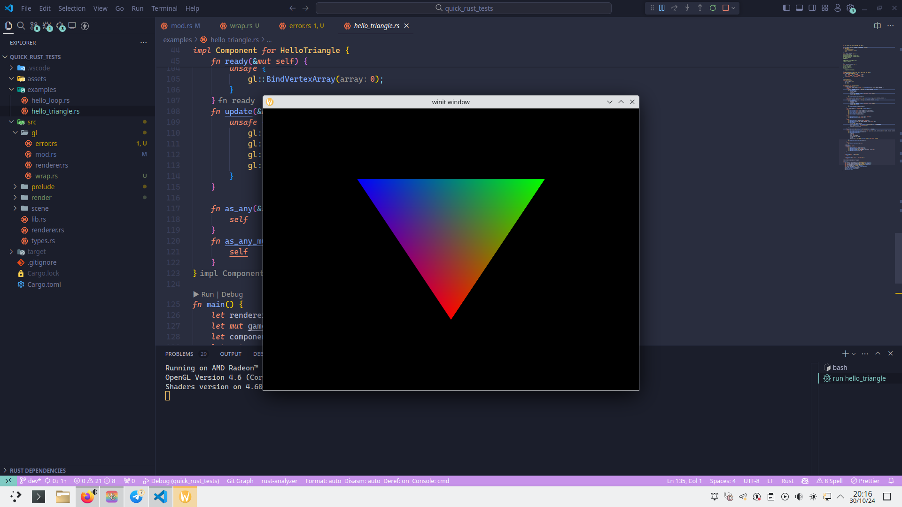

## Virtual Reality

In 2022, I was invited to a small expo in town to do a VR demonstration. This demo, made in Godot, consisted of a set rooms and physical mini games, which included a slingshot, boxes that could be piled up, a bowling pin throwing stage, and a dark room with a torch. The demo was exported to both, Windows and Android (Meta Quest 2).

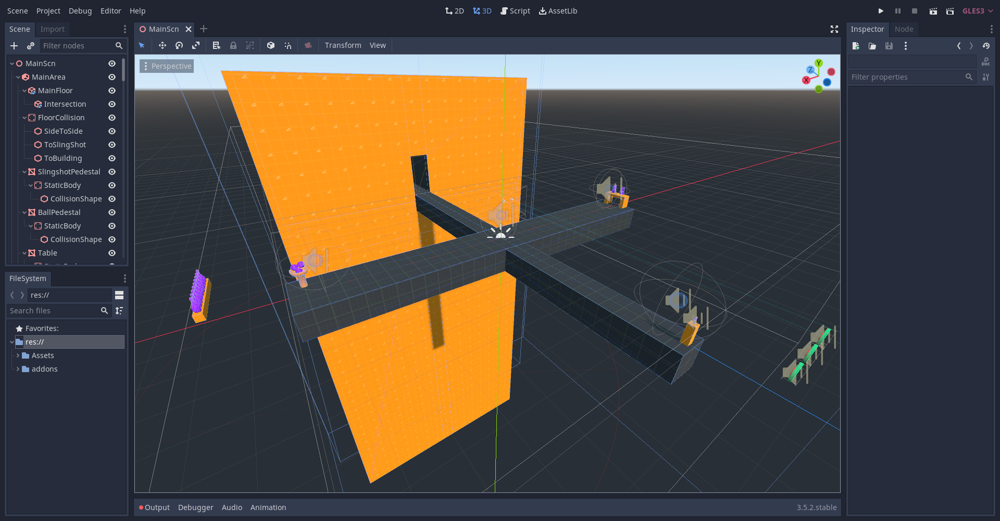

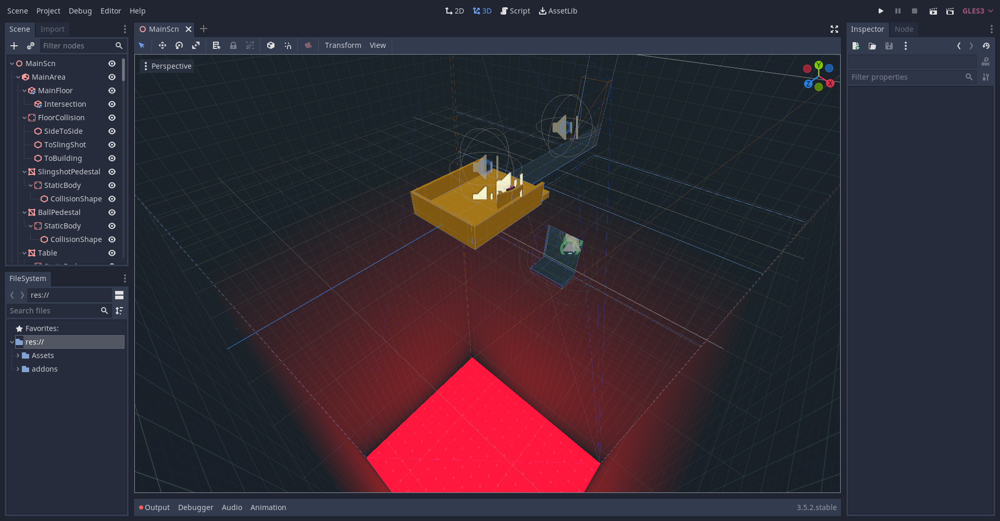

## Hardware

Ever since I was a child, I started learning robotics. That has given me quite a bit of knowledge on hardware design. I won't claim I'm the best with it, but it doesn't scare me either.

In 2023, I designed and made a kit of DIY [SlimeVR](https://slimevr.dev/) controllers. These controllers had a custom made board on which components where attached, and own design 3D printed cases.

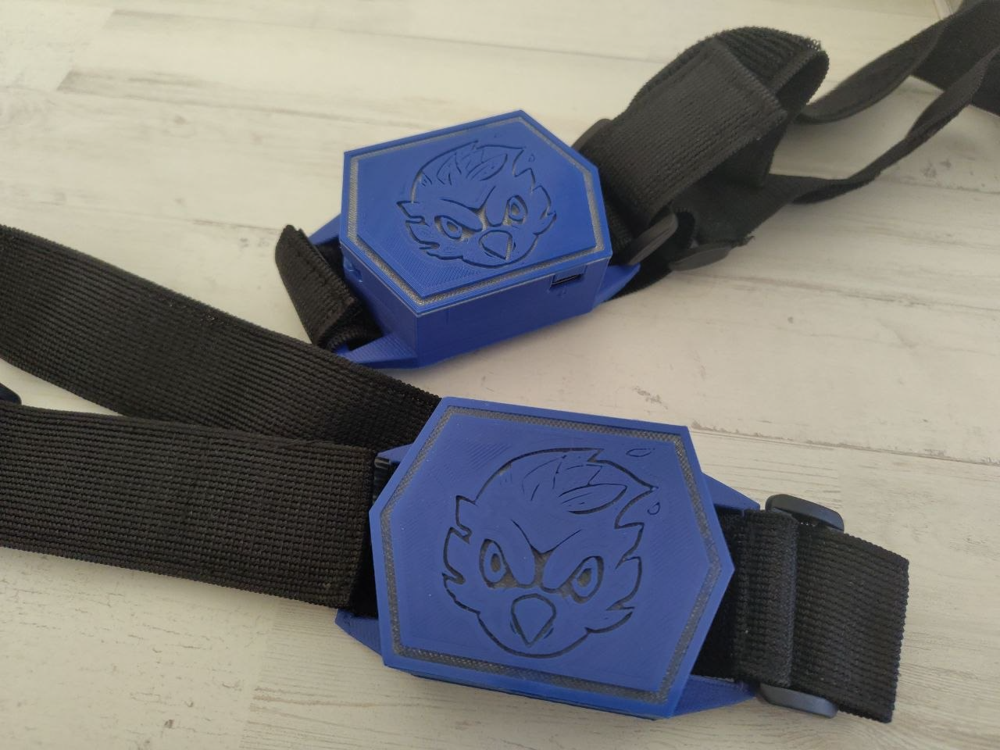

I made a fully integrated redesign, but as it required smaller components, it was never made. It was a 33% smaller design.

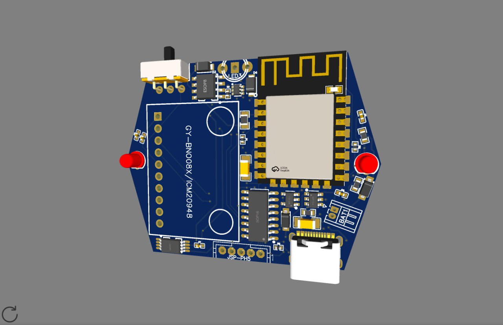

## Virtualization

Up until 2025, my setup consisted of a desktop Linux with a Windows virtual machine for VR. Though this is no longer necessary (I use Monado), the experience gained was quite important. The setup consisted of a dual-GPU (Nvidia + AMD), where the first would be attached permanently to the hypervisor, making the transition between systems seamless. LookinGlass was my preferred option for visuals and input handling, and with a VM on this level, performance was excellent. It also had network bridge in order to connect my Quest 2 wirelessly.

## Skills

**Programming languages**

* Bash / Shell
* C++
* C#
* CSS
* GDScript
* Golang
* GLSL
* HLSL
* HTML
* Java
* JavaScript
* Kotlin
* PHP
* PowerShell
* Python
* Rust
* SQL
* TypeScript

**Technologies**

* Android
* Angular
* Arduino
* ASP.NET
* Bevy
* Docker
* GeoServer
* GDAL lib
* Git
* GitHub
* GitLab
* HTTP / REST
* Keycloak
* Linux
* MapLibre GL JS
* Postgres (with PostGIS)
* MariaDB
* MySQL
* Nakama
* NginX
* Ollama
* OneDev
* OpenGL
* Open WebUI
* QGIS plugins
* Rocket.rs
* Spring boot
* SQLite
* SSH
* Traefik
* Virtualization (LibVirt, QEMU, KVM)
* WebRTC
* WebSockets

**Programs**

* Android Studio
* Blender
* GameMaker: Studio 1 & 2
* Godot Engine 3 & 4
* IntelliJ
* Krita
* Unity
* Visual Studio
* VSCode

**Languages**

* Spanish (native)
* English (B2/C1)
* Portuguese (A1/A2)
* Dutch (0/A1)

## Where to find me

* 📓 [LinkedIn](https://www.linkedin.com/in/daniel-p-2214943b9/)
* 🐦 [Twitter](https://twitter.com/BlueHarrierDev)
* 🎮 [Itch.io](https://blueharrier.itch.io/)
* 💰 [Patreon](https://patreon.com/blueharrier?utm_medium=unknown&utm_source=join_link&utm_campaign=creatorshare_creator&utm_content=copyLink)
