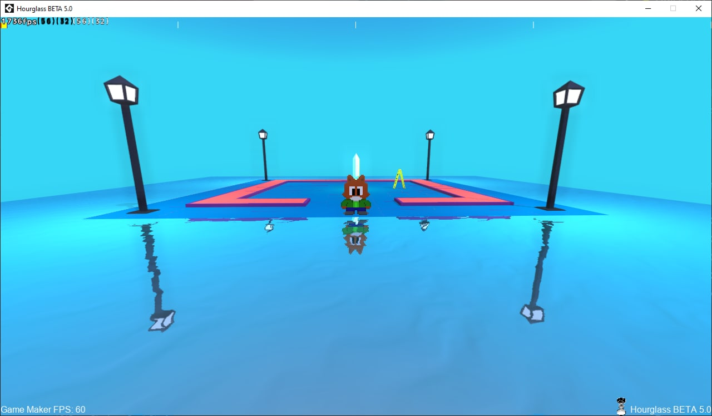
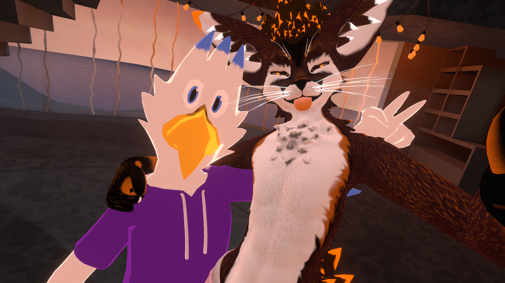

# BlueHarrier

🐦 Hello there and welcome to the nest. Here you'll find all of what I've done so far or stuff that I'm working on right now. Feel free to have a look, comment on it, or make a fork if you wish!

## Formation and career

I'm a teacher and video game development student, currently on multiplatform development and animation, games and interactive environments degrees. I've been working on video games since 2016, and also worked as a volunteer on robotics education using Minecraft from 2014 to 2018. I also completed a Unity summer course on 2017, and a professional expert in educational robotics course on 2019. My team and I were also finalists on the Spanish programming competition "ProgramaMe" 2023, and I attended to two RoboRave Iberias, 2016 as a drone pilot (participant) and 2017 with the Sirok3D 3D printing stand.

I've participated in a total of three freelance projects with different local companies:
1. A video game development pilot class weekend in 2018 with Robotilandia.
2. "Minecraft Big Buildings Quest", a week long Minecraft summer camp with Sirok3D in 2017.
3. A VR development introduction showcase in "El Hospital", Badajoz in 2022.

I'm currently studying the ULM pilot theory course as well.

## Shaders and pipelines

Ever since I have memory, video games graphics have amazed me, and back in 2017 I started learning shaders and how render works. During the following years, in 2018 I started developing an entire library of shaders and pipelines that made the 2D game engine GameMaker 2 into a functional 3D engine, with lighting, shadows and post-processing.

The current state of my "Hourglass Framework" supports raw buffer models, 3D sprites, simple 3D bounding boxes, tinted shadows, translucent objects, dynamic lights (point, directionals and spotlights), static geometry batching and dynamic asset load and deload.

## Virtual Reality

I acquired my first VR headset in 2018, an Oculus Rift kit, but I didn't get into more serious development until 2022, when I obtained a Meta Quest 2 kit. The demo I made was designed to be showcased in "El Hospital", a place in Badajoz that organizes expositions and similar events. The first day it was running on a laptop, but the second day it was updated to run natively on Quest 2.

The demo consisted of an exterior room with three physics game: cubes that can be piled, bowling pins that can be knocked down and a slingshot.

In the interior section there's an elevator with an animation and a dark area where some glowsticks and a flashlight can be picked up.

I'm inside a VR community in which I've learned to make efficient avatars and worlds for VRChat. I made my own avatar entirely, including model, texturing and shader.

We have our own world, made and still work in progress, already published and [available for everyone](https://vrchat.com/home/launch?worldId=wrld_c73ff0e3-a032-4d84-ace2-6590d04435de) to see.

## Knowledge

**Languages I speak**
* Spanish
* English
* Dutch (learning)

**Programming languages I'm familiarized with**
* Game Maker Language (similar to C++)
* GDScript (similar to Python)
* Java
* PHP
* C#
* Python
* C++

**Game engines I've used**
* GameMaker: Studio 2
* Godot Engine 3
* Unity
* Unreal Engine 4

## Other places

You can find me on:
* 📓 [LinkedIn](https://www.linkedin.com/in/blueharrier/)
* 🐦 [Twitter](https://twitter.com/BlueHarrierDev)
* ✈️ [Telegram](https://t.me/BlueHarrier)
* 🚂 [Steam](https://steamcommunity.com/id/BlueHarrier/)
